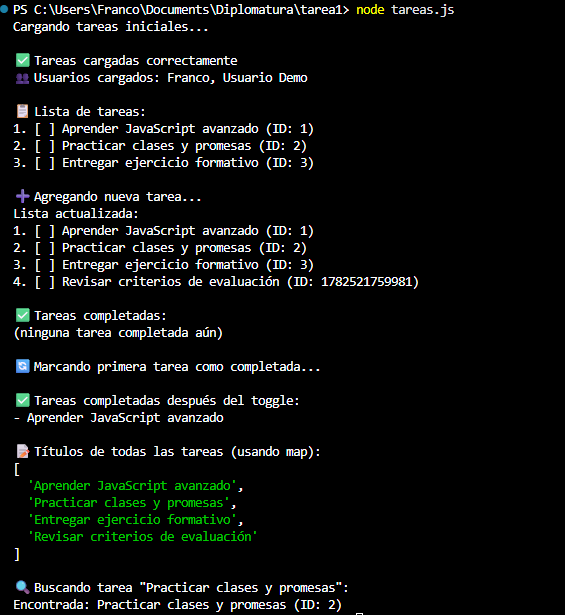

# Mi Primera Página Web

Este proyecto es una página web semántica y estilizada creada como parte del Módulo 1 - Unidad 1 de la Diplomatura en Desarrollo Web.

## Descripción

Una página web completa que implementa estructura semántica HTML5 y estilos CSS con variables, selectores y buenas prácticas. La página incluye:

- Header con título y menú de navegación
- Artículo con contenido semántico, imagen y lista ordenada
- Formulario de contacto con campos validados
- Footer con información del autor

## Características Técnicas

### HTML
- Estructura semántica correcta con header, main, footer, article, section
- Uso adecuado de atributos (lang, alt, for, name)
- Formulario completo con diferentes tipos de campos

### CSS
- Variables CSS para colores y tipografía
- Selectores de clase e ID
- Estilos externos (sin estilos en línea)
- Diseño responsive y moderno

## Instrucciones para Clonar y Ejecutar

1. Clona el repositorio:
   ```bash
   git clone <URL-del-repositorio>
   cd tarea1
   ```

2. Abre el archivo `index.html` en tu navegador web preferido:
   ```bash
   # Abrir con Chrome
   chrome index.html
   
   # O simplemente haz doble clic en el archivo
   ```

## Capturas de Pantalla



## Créditos

- **Autor**: Franco
- **Curso**: Diplomatura en Desarrollo Web
- **Unidad**: Módulo 1 - Unidad 1
- **Asignatura**: Mi primera página web semántica y estilizada


