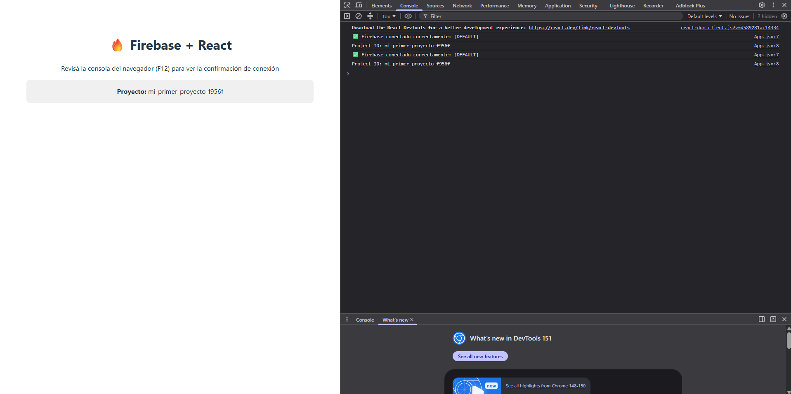
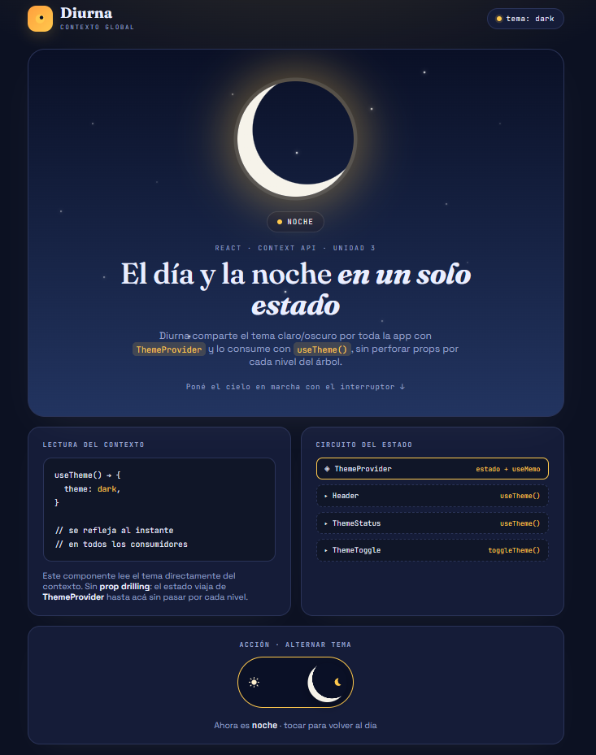

# Mi App con Contexto Global

Ejemplo de React Avanzado (Módulo 3 - Unidad 3) que aplica la **Context API** de
React para compartir y consumir una información global (el **tema claro/oscuro**)
en toda la aplicación, evitando el **prop drilling**.

## Caso de uso

Se elige el **tema (claro/oscuro)** como información global:

- Es útil en toda la app (header, tarjetas, botones, fondo, etc.).
- Requiere que todos los componentes reaccionen al cambio en tiempo real.
- No tiene sentido pasarlo por props de nivel en nivel: la Context API es la
  solución correcta.

## Estructura del proyecto

```
src/
├── components/
│   ├── Header.jsx        # Consumidor: muestra el tema actual (badge)
│   ├── ThemeStatus.jsx   # Consumidor: muestra el estado global compartido
│   ├── ThemeToggle.jsx   # Consumidor y modificador: alterna el tema
│   └── SinProvider.jsx   # Prueba funcional: useContext fuera del Provider
├── context/
│   ├── ThemeContext.jsx  # Context + Provider
│   └── useTheme.js       # Hook que consume el contexto
├── App.jsx               # Composición de la app
├── main.jsx              # Envuelve App con ThemeProvider
└── index.css             # Variables CSS para tema claro/oscuro
```

## Contexto

`src/context/ThemeContext.jsx` contiene:

- `ThemeContext`: el contexto creado con `createContext(undefined)`.
- `ThemeProvider`: componente que guarda el estado del tema con `useState` y
  provee el valor con `useMemo` (para evitar renders innecesarios). Además
  sincroniza el tema con el atributo `data-theme` del documento.
- `useTheme()`: hook que consume el contexto y lanza un error claro si se usa
  fuera del provider.

```jsx
const value = useMemo(
  () => ({
    theme,
    toggleTheme: () =>
      setTheme((current) => (current === 'light' ? 'dark' : 'light')),
  }),
  [theme],
)
```

## Instalación y ejecución

```bash
npm install
npm run dev
```

Abrir la URL que muestra Vite (por defecto http://localhost:5173).

## Prueba funcional

1. **Cambio reflejado en todos los consumidores:** al hacer clic en el botón
   "Cambiar a tema oscuro/claro", el header, la tarjeta de estado y el fondo de
   toda la app se actualizan al instante. El estado se modifica en un único
   lugar (`ThemeToggle`) y se refleja en todos los que consumen el contexto.
2. **Sin Provider:** el componente `SinProvider` se renderiza fuera de
   `ThemeProvider` y muestra que `useContext(ThemeContext)` devuelve
   `undefined`, tal como lo define React. Si se usa el hook `useTheme()` fuera
   del provider, este lanza un error descriptivo.

## Capturas



## Créditos

-Trabajo práctico de React Avanzado — Módulo 3, Unidad 3.

-Franco Lapalma

## Bibliografía

- Banks, A. y Porcello, E. _Learning React: Modern Patterns for Developing
  React Apps._ 2ª ed. O'Reilly Media; 2020.
- React. (s.f.-a). _Passing Data Deeply with Context._
  https://react.dev/learn/passing-data-deeply-with-context
- React. (s.f.-b). _useContext._ https://react.dev/reference/react/useContext
- React. (s.f.-c). _useMemo._ https://react.dev/reference/react/useMemo
