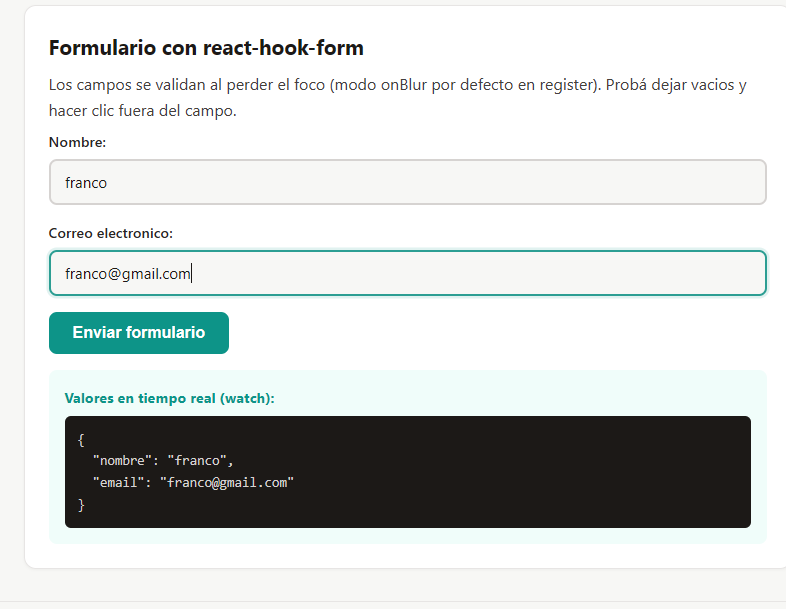
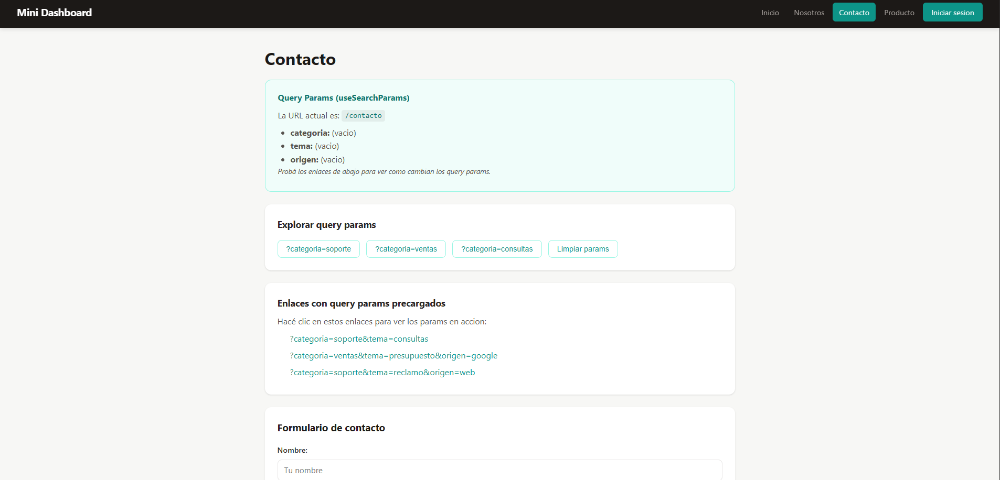
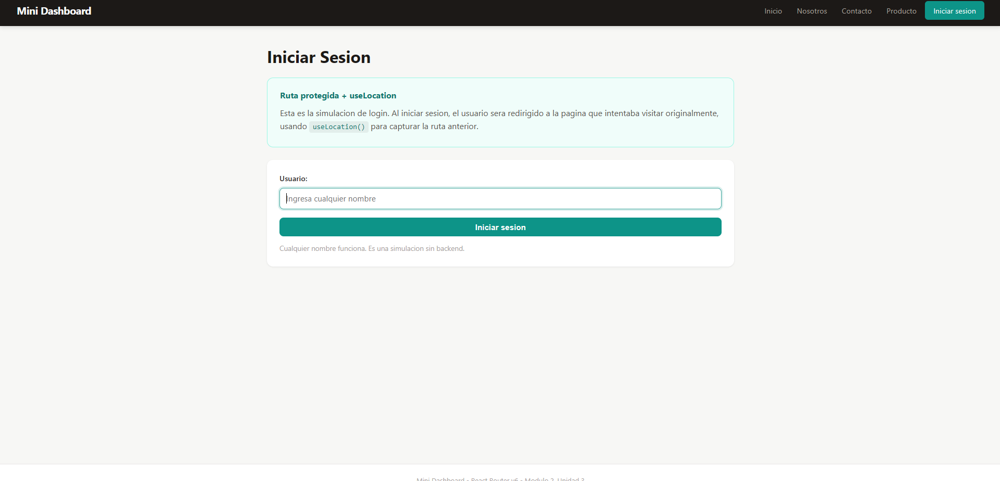
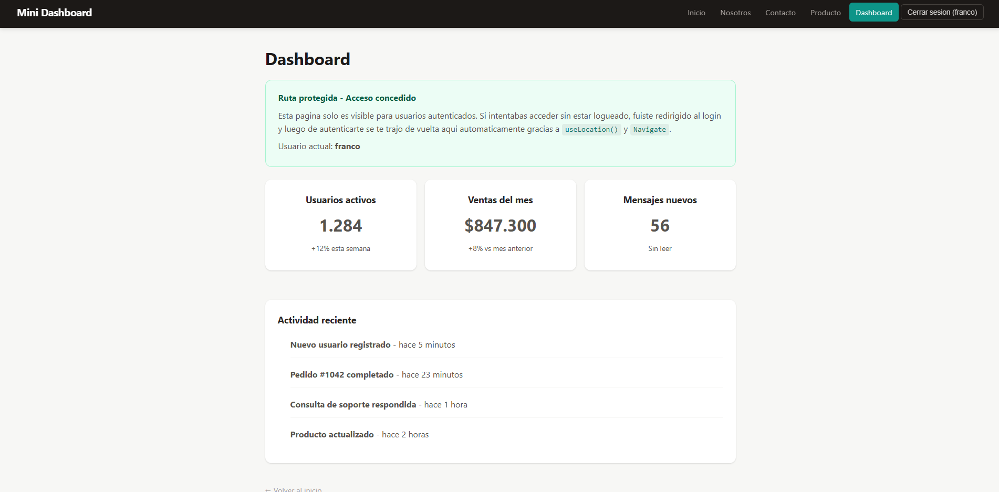

# Mini Dashboard - React Router

Proyecto educativo que demuestra el uso completo de **React Router v6** con rutas publicas, protegidas, dinamicas, query params, navegacion declarativa e imperativa, y rutas anidadas con `<Outlet>`.

## Descripcion

Mini Dashboard es una aplicacion React construida con Vite que implementa todos los conceptos fundamentales de enrutamiento en React Router DOM v6. El proyecto incluye un sistema de autenticacion simulado para demostrar rutas protegidas con redireccion post-login usando `useLocation` y `Navigate`.

## Conceptos implementados

| Concepto | Hook / Componente | Pagina de ejemplo |
|---|---|---|
| Rutas basicas | `BrowserRouter`, `Routes`, `Route` | Todas |
| Navegacion declarativa | `<Link>`, `<NavLink>` | Navbar, Inicio |
| Navegacion imperativa | `useNavigate()` | Inicio, Producto |
| Ruta dinamica | `useParams()` | Producto (`/producto/:id`) |
| Query params | `useSearchParams()` | Contacto |
| Rutas anidadas | `<Outlet>` | Layout + todas las paginas |
| Ruta protegida | `Navigate`, `useLocation` | Dashboard |
| Context API | `createContext`, `useContext` | AuthContext |

## Estructura del proyecto

```
mini-dashboard/
├── public/
├── src/
│   ├── components/
│   │   ├── Layout.jsx        # Layout con Navbar + Outlet
│   │   ├── Navbar.jsx         # Navegacion con Link/NavLink
│   │   └── ProtectedRoute.jsx # Componente de ruta protegida
│   ├── context/
│   │   └── AuthContext.jsx    # Contexto de autenticacion simulada
│   ├── pages/
│   │   ├── Inicio.jsx         # Ruta estatica + useNavigate
│   │   ├── Nosotros.jsx       # Ruta estatica
│   │   ├── Contacto.jsx       # useSearchParams
│   │   ├── Producto.jsx       # useParams + useNavigate
│   │   ├── Dashboard.jsx      # Ruta protegida
│   │   └── Login.jsx          # useLocation + redireccion post-login
│   ├── App.jsx                # Definicion de rutas
│   ├── App.css                # Estilos globales
│   └── main.jsx               # Punto de entrada
├── index.html
├── package.json
├── vite.config.js
├── .gitignore
└── README.md
```

## Instalacion y ejecucion

### Requisitos previos
- Node.js 18 o superior
- npm 9 o superior

### Pasos

1. Clonar el repositorio:
```bash
git clone <url-del-repositorio>
cd mini-dashboard
```

2. Instalar dependencias:
```bash
npm install
```

3. Iniciar el servidor de desarrollo:
```bash
npm run dev
```

4. Abrir en el navegador la URL que indica la terminal (generalmente `http://localhost:5173`).

## Rutas disponibles

| Ruta | Tipo | Descripcion |
|---|---|---|
| `/` | Publica | Pagina de inicio con cards de navegacion |
| `/nosotros` | Publica | Informacion sobre el proyecto |
| `/contacto` | Publica | Formulario con query params |
| `/contacto?categoria=soporte&tema=consultas` | Publica | Contacto con params en la URL |
| `/producto/:id` | Dinamica | Muestra producto segun el ID |
| `/login` | Publica | Formulario de login simulado |
| `/dashboard` | **Protegida** | Requiere autenticacion |
| `*` | Publica | Pagina 404 |

## Capturas de pantalla

### Inicio - Rutas estaticas y navegacion declarativa

La pagina de inicio muestra cards con enlaces `<Link>` a las distintas secciones del proyecto, incluyendo un ejemplo de `useNavigate()` para navegacion imperativa.

### Producto - Ruta dinamica con useParams

La URL `/producto/1` muestra el producto con ID 1. Cambiando el numero en la URL se muestra un producto diferente. Los botones usan `useNavigate()` para navegar entre productos.

### Contacto - Query params con useSearchParams

La pagina de contacto lee los parametros de la URL (`?categoria=...&tema=...`) usando `useSearchParams()`. Incluye botones para modificar los params y un formulario que los actualiza al enviar.

### Login - useLocation y redireccion post-login

Cuando un usuario no autenticado intenta acceder al Dashboard, es redirigido al Login. El componente Login usa `useLocation()` para saber de que ruta venia y redirige ahi despues del login.

### Dashboard - Ruta protegida

Solo accesible despues de iniciar sesion. Si se intenta acceder sin autenticacion, `ProtectedRoute` redirige al Login usando `Navigate` con el estado de la ubicacion actual.

## Tecnologias

- **React 18** - Libreria de UI
- **React Router DOM v6** - Enrutamiento
- **Vite 6** - Bundler y servidor de desarrollo
- **CSS puro** - Estilos (sin frameworks externos)

## Bibliografia

- Abramov, D. y Clark, A. *Fullstack React: The Complete Guide to ReactJS and Friends*. 1a ed. Accomazzo LLC; 2017.
- Banks, A. y Porcello, E. *Learning React: Modern Patterns for Developing React Apps*. 2a ed. O'Reilly Media; 2020.
- MDN Web Docs. (s.f.). *URLSearchParams*. Mozilla Corporation. https://developer.mozilla.org/en-US/docs/Web/API/URLSearchParams
- React Router. (s.f.). *Tutorial*. https://reactrouter.com/en/main/start/tutorial
- React Router API Reference. *Function useNavigate*. https://reactrouter.com/en/main/hooks/use-navigate

---

**Autor:** Franco Lapalma  
**Curso:** Desarrollo en Node.js  
**Unidad:** Modulo 2 - Unidad 3 - Enrutamiento  