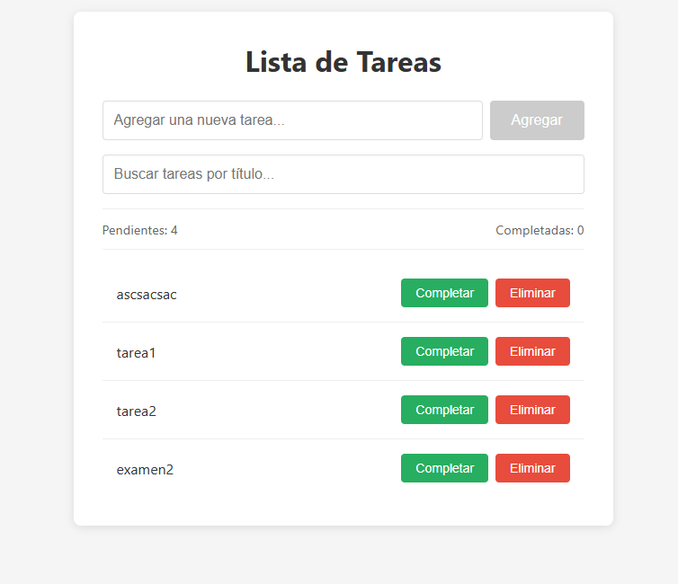

# Lista de Tareas - React + Vite

## Descripción

Aplicación de lista de tareas (Todo List) desarrollada con React y Vite que implementa los hooks fundamentales de React:

- **useState**: Gestión de estado local (tareas, input, búsqueda)
- **useEffect**: Efectos secundarios (auto-enfoque al montar, sincronización localStorage)
- **useRef**: Referencia al input para auto-enfoque
- **useMemo**: Optimización del filtrado de tareas y contadores
- **useCallback**: Optimización de funciones pasadas a componentes hijos
- **Custom Hook (useLocalStorage)**: Persistencia automática en localStorage

### Funcionalidades

- ✅ Agregar nuevas tareas
- ✅ Marcar tareas como completadas/pendientes
- ✅ Eliminar tareas
- ✅ Buscar/filtar tareas por título
- ✅ Limpiar tareas completadas
- ✅ Contadores de tareas pendientes y completadas
- ✅ Persistencia automática en localStorage
- ✅ Auto-enfoque en el input al cargar

### Extras opcionales implementados

- ✅ Mostrar cuántas tareas están completadas y cuántas pendientes
- ✅ Uso de `useCallback` para optimizar funciones pasadas a componentes hijos (TaskItem)

## Instalación y ejecución

1. Clonar el repositorio:
```bash
git clone <url-del-repositorio>
cd tarea1
```

2. Instalar dependencias:
```bash
npm install
```

3. Ejecutar en modo desarrollo:
```bash
npm run dev
```

4. Abrir en el navegador la URL que indique Vite (por defecto `http://localhost:5173`)

### Scripts disponibles

- `npm run dev` - Inicia servidor de desarrollo
- `npm run build` - Construye para producción
- `npm run preview` - Previsualiza la build de producción

## Estructura del proyecto

```
src/
├── hooks/
│   └── useLocalStorage.js    # Custom hook para localStorage
├── components/
│   ├── TodoApp.jsx           # Componente principal
│   └── TaskItem.jsx          # Componente hijo para cada tarea
├── App.jsx                   # Componente raíz
├── App.css                   # Estilos de la aplicación
├── main.jsx                  # Punto de entrada
└── index.css                 # Estilos globales
```

## Capturas de pantalla




## Créditos

**Autor:** Franco Lapalma  
**Curso:** Diplomatura en Desarrollo Web  
**Unidad:** React - Hooks y Custom Hooks

## Bibliografía y fuentes

- React Official Documentation. *useState*. https://react.dev/reference/react/useState
- React Official Documentation. *useEffect*. https://react.dev/reference/react/useEffect
- React Official Documentation. *useRef*. https://react.dev/reference/react/useRef
- React Official Documentation. *useMemo*. https://react.dev/reference/react/useMemo
- React Official Documentation. *useCallback*. https://react.dev/reference/react/useCallback
- React Official Documentation. *Reusing Logic with Custom Hooks*. https://react.dev/learn/reusing-logic-with-custom-hooks
- Banks, A. y Porcello, E. *Learning React: Modern Patterns for Developing React Apps*. 2ª ed. O'Reilly Media; 2020.
- Abramov, D. y Clark, A. *Fullstack React*. 1ª ed. Accomazzo LLC; 2017.
