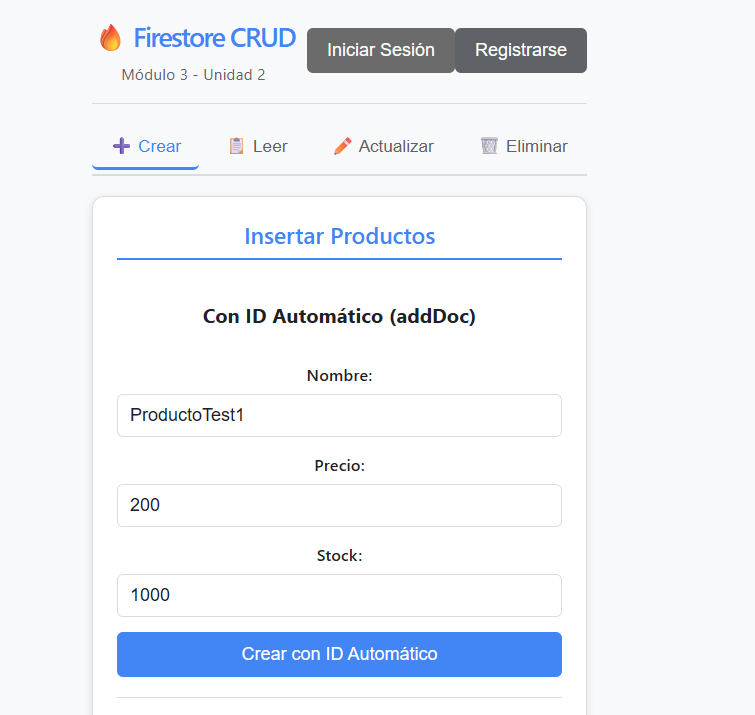
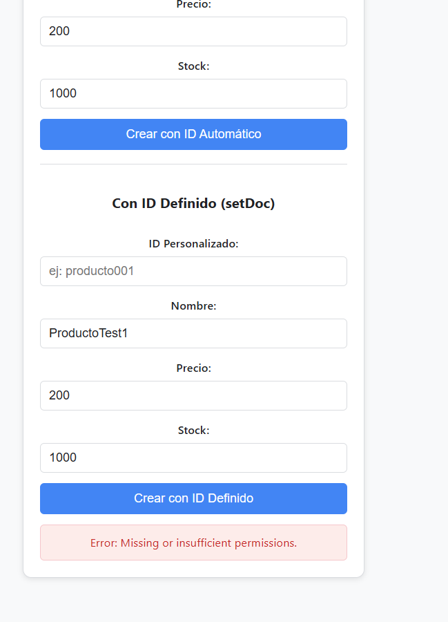
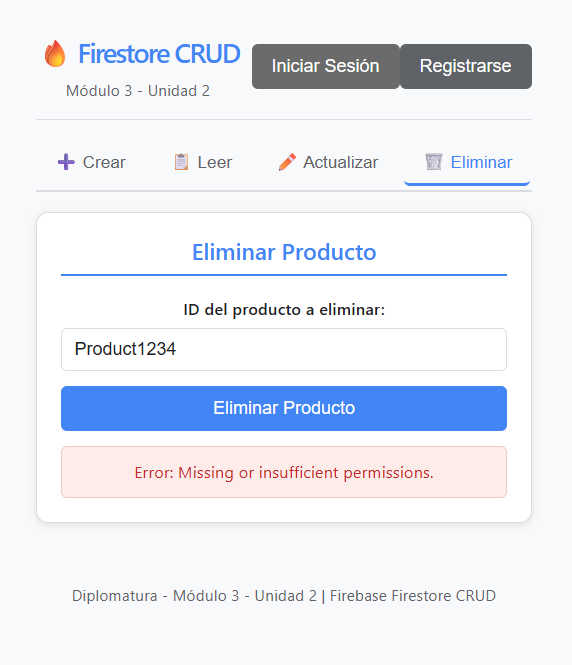
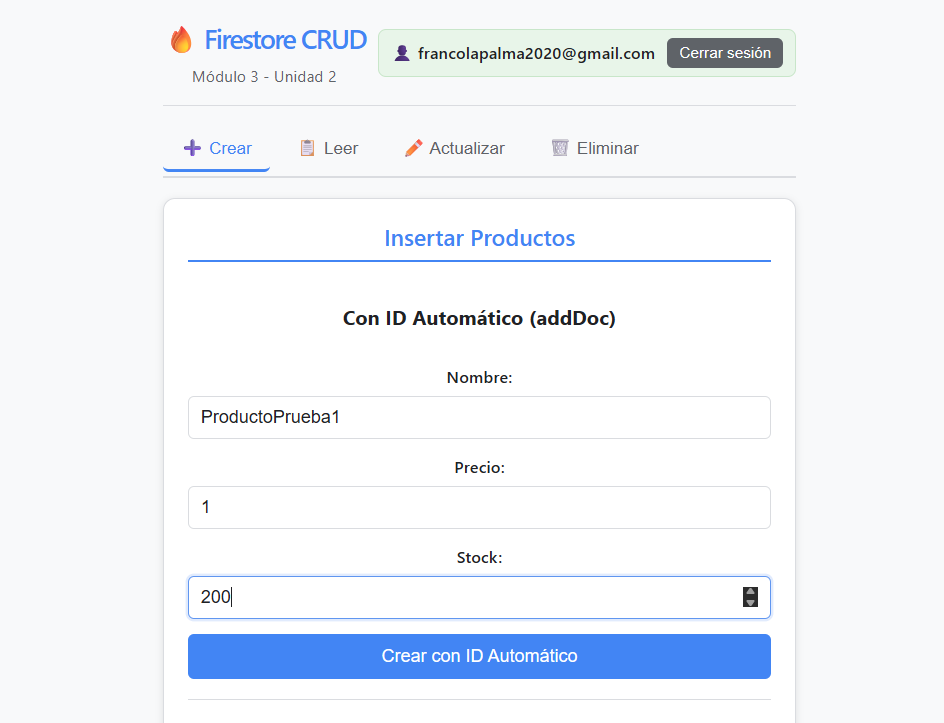
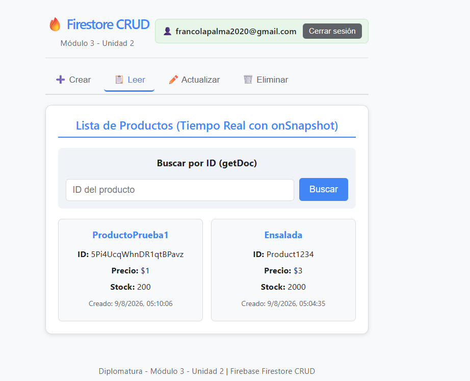
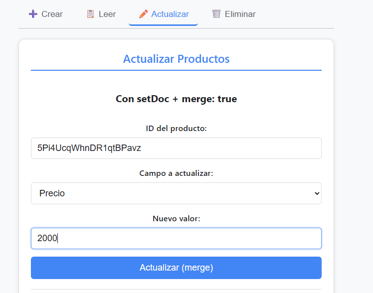
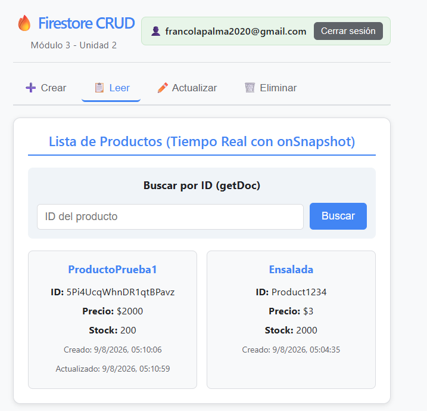
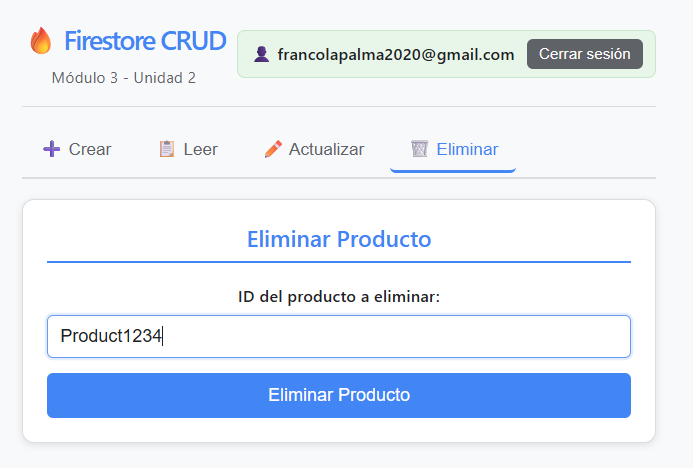
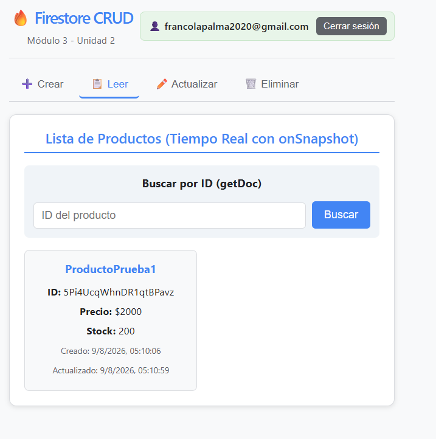

# Firestore CRUD - Módulo 3 Unidad 2

Proyecto de React + Vite + Firebase Firestore que implementa operaciones CRUD completas (Crear, Leer, Actualizar, Eliminar) con suscripciones en tiempo real y reglas de seguridad.

## 📋 Descripción

Este proyecto demuestra el uso de Cloud Firestore en una aplicación React, implementando:

- **Crear**: `addDoc` (ID automático) y `setDoc` (ID personalizado)
- **Leer**: `getDocs` (todos), `getDoc` (por ID), `onSnapshot` (tiempo real)
- **Actualizar**: `setDoc` con `merge: true` y `updateDoc`
- **Eliminar**: `deleteDoc`
- **Seguridad**: Reglas de Firestore que restringen escritura a usuarios autenticados

## 🛠 Tecnologías

- React 18 + Vite
- Firebase 10+ (Firestore, Auth)
- JavaScript ES6+

## 📦 Instalación

```bash
# Clonar el repositorio
git clone <url-del-repositorio>
cd firestore-crud

# Instalar dependencias
npm install

# Configurar variables de entorno
cp .env.example .env
# Editar .env con tus credenciales de Firebase

# Ejecutar en desarrollo
npm run dev
```

## 🔧 Configuración de Firebase

### 1. Crear proyecto en Firebase Console
1. Ve a [Firebase Console](https://console.firebase.google.com/)
2. Crea un nuevo proyecto
3. Habilita **Authentication** → **Email/Password**
4. Habilita **Firestore Database** → Crear base de datos en modo prueba

### 2. Obtener credenciales
1. En Configuración del proyecto → General → Tus apps → Agregar app web
2. Copia las credenciales a tu archivo `.env`:

```env
VITE_FIREBASE_API_KEY=tu_api_key
VITE_FIREBASE_AUTH_DOMAIN=tu_proyecto.firebaseapp.com
VITE_FIREBASE_PROJECT_ID=tu_proyecto_id
VITE_FIREBASE_STORAGE_BUCKET=tu_proyecto.appspot.com
VITE_FIREBASE_MESSAGING_SENDER_ID=tu_sender_id
VITE_FIREBASE_APP_ID=tu_app_id
```

### 3. Configurar reglas de seguridad
En Firestore → Reglas, pega el contenido de `firestore.rules`:

```javascript
rules_version = '2';
service cloud.firestore {
  match /databases/{database}/documents {
    match /productos/{document} {
      allow read: if true;
      allow create: if request.auth != null;
      allow update: if request.auth != null;
      allow delete: if request.auth != null;
    }
    match /{document=**} {
      allow read, write: if false;
    }
  }
}
```

Publica las reglas.

## 📁 Estructura del Proyecto

```
src/
├── firebase/
│   ├── config.js      # Inicialización centralizada de Firebase
│   └── crud.js        # Operaciones CRUD (addDoc, setDoc, getDoc, updateDoc, deleteDoc, onSnapshot)
├── hooks/
│   └── useProductos.js # Hooks personalizados para datos en tiempo real
├── components/
│   ├── ProductoForm.jsx    # Crear con addDoc y setDoc
│   ├── ProductoList.jsx    # Leer todos, por ID, tiempo real
│   ├── ProductoUpdate.jsx  # Actualizar con merge y updateDoc
│   ├── ProductoDelete.jsx  # Eliminar con deleteDoc
│   └── AuthComponent.jsx   # Autenticación para probar seguridad
├── App.jsx            # Componente principal
├── App.css            # Estilos
└── main.jsx           # Punto de entrada
```

## 🎯 Operaciones CRUD Implementadas

### 1. Crear (Create)
| Método | Descripción | Componente |
|--------|-------------|------------|
| `addDoc` | ID automático generado por Firestore | `ProductoForm` (primer formulario) |
| `setDoc` | ID definido por el usuario (ej: "producto001") | `ProductoForm` (segundo formulario) |

### 2. Leer (Read)
| Método | Descripción | Componente |
|--------|-------------|------------|
| `getDocs` | Obtener toda la colección | `ProductoList` (lista principal) |
| `getDoc` | Obtener documento por ID | `ProductoList` (buscador por ID) |
| `onSnapshot` | Suscripción tiempo real | `ProductoList` (actualización automática) |

### 3. Actualizar (Update)
| Método | Descripción | Componente |
|--------|-------------|------------|
| `setDoc(merge:true)` | Actualización parcial, crea si no existe | `ProductoUpdate` (primer formulario) |
| `updateDoc` | Actualización parcial, falla si no existe | `ProductoUpdate` (segundo formulario) |

### 4. Eliminar (Delete)
| Método | Descripción | Componente |
|--------|-------------|------------|
| `deleteDoc` | Eliminar documento por ID | `ProductoDelete` |

## 🔐 Pruebas de Seguridad

### Sin autenticar (debe fallar):
1. Intenta crear un producto → **Error: Missing or insufficient permissions**
2. Intenta actualizar un producto → **Error: Missing or insufficient permissions**
3. Intenta eliminar un producto → **Error: Missing or insufficient permissions**
4. Leer productos → **Funciona** (lectura permitida para todos)

### Autenticado (debe funcionar):
1. Registra un usuario en la sección "Autenticación"
2. Inicia sesión
3. Repite las operaciones CRUD → **Todas funcionan**

## 📸 Capturas de Pantalla

### 1. Inserción con addDoc y setDoc


### 2. Lista de productos y búsqueda por ID


### 3. Actualización en tiempo real con onSnapshot


### 4. Actualización con merge y updateDoc


### 5. Eliminación y verificación


### 6. Pruebas de reglas sin autenticar / autenticado


### 7. Vista de pestaña Crear


### 8. Vista de pestaña Leer


### 9. Vista de pestaña Actualizar/Eliminar


## 📚 Bibliografía y Fuentes

- Firebase. *Primeros pasos con Cloud Firestore*. https://firebase.google.com/docs/firestore/quickstart
- Firebase. *Agrega datos a Cloud Firestore*. https://firebase.google.com/docs/firestore/manage-data/add-data
- Firebase. *Obtén datos con Cloud Firestore*. https://firebase.google.com/docs/firestore/query-data/get-data
- Firebase. *Actualiza datos en Cloud Firestore*. https://firebase.google.com/docs/firestore/manage-data/update-data
- Firebase. *Borra datos de Cloud Firestore*. https://firebase.google.com/docs/firestore/manage-data/delete-data
- Firebase. *Comienza a usar las reglas de seguridad de Cloud Firestore*. https://firebase.google.com/docs/firestore/security/get-started
- Banks, A. y Porcello, E. *Learning React: Modern Patterns for Developing React Apps*. 2ª ed. O'Reilly Media; 2020.
- Gupta, S. *Getting Started with Firebase*. 1ª ed. Packt Publishing; 2017.

## 👨‍💻 Créditos

**Autor**: Franco  
**Curso**: Diplomatura - Módulo 3 - Unidad 2  
**Tema**: Mi primer CRUD en Firestore

## 📄 Licencia

Proyecto educativo para fines de aprendizaje.